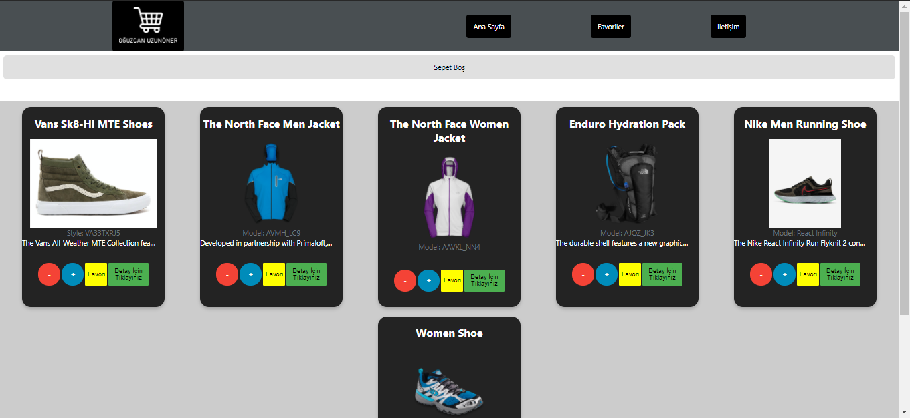
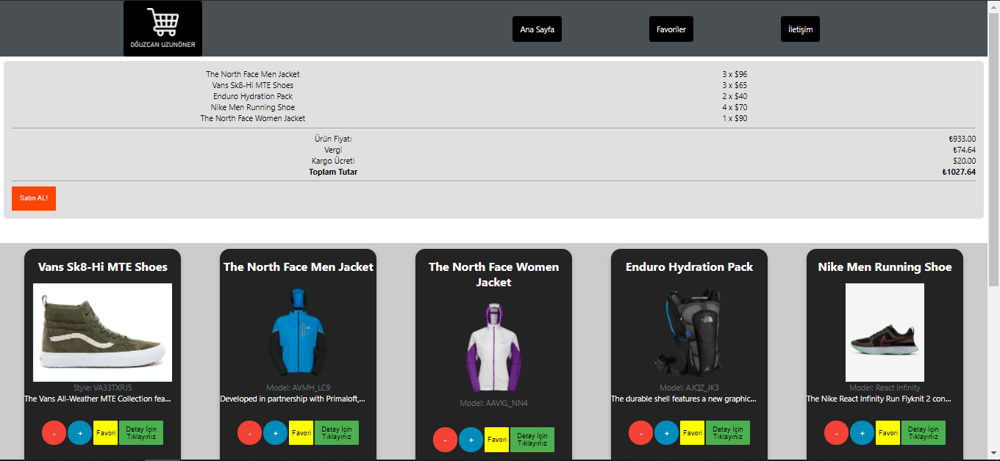
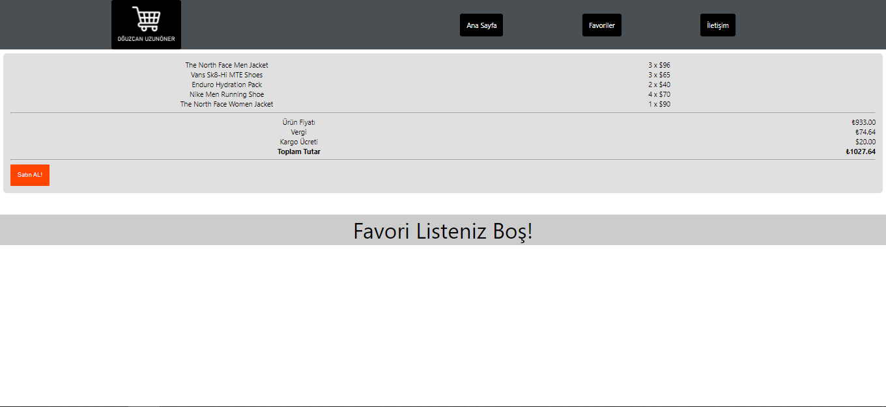
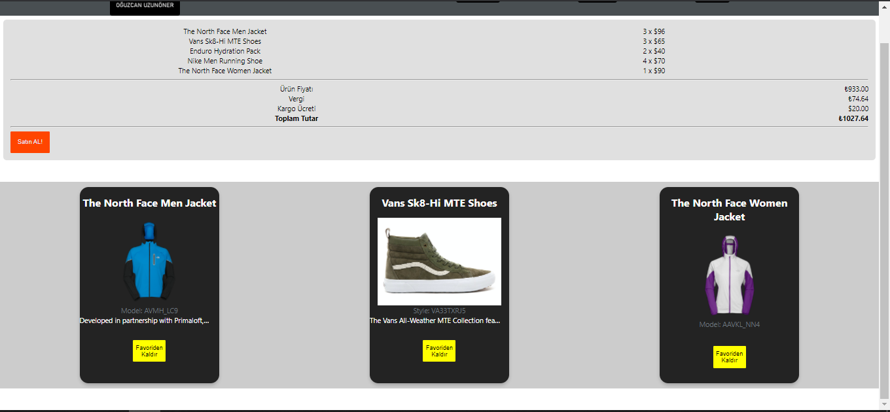
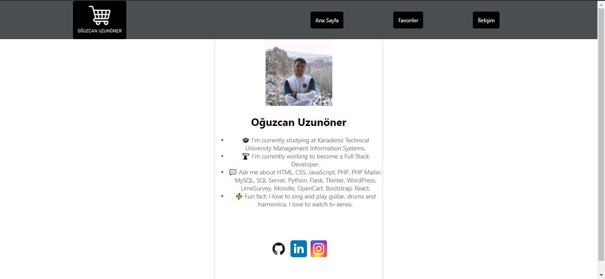

## NETLIFY DEMO
[NETLIFY DEMO - CLICK ](https://compassionate-joliot-442eb2.netlify.app/)

# e-Commerce Uygulaması

Uygulamamızda, API'den çekilen ürün bilgilerini listeliyoruz. Bu listenen ürünleri sepetinize ekleyebiliyor, sepetten silebiliyor ve aynı zamanda favori olarak ekleyebilip/silebiliyorsunuz.

## Proje Hakkında

Bu projede, Ana sayfanızda olan ürünleri sepetinize ekleyebiliyor ve sepetten kaldırabiliyorsunuz. Sepete eklediğiniz ürünlerin fiyatları otomatik olarak hesaplanıyor ve sepette gösteriliyor. Dilediğiniz ürünü favorilerinize ekleyebiliyorsunuz. Menüde bulunan "Favoriler" kısmında ise favori ürünlerinizi görüntüleyip, ürünlerinizi kaldırabiliyorsunuz. Ürünlerde bulunan "Detay İçin Tıklayınız" butonuna bastığınızda, ürünün id'si API üzerinden filtrelenip, ilgili ürün size gösteriliyor. "İletişim" kategorisinde ise bana ait bilgilere ulaşabilirsiniz.

## Proje Teknik Bilgileri

* Dinamik Url yapısı için React-Router-Dom kullanılmıştır.
* Bilgiler API'den çekilmiştir. Bunun için MockApi kullanılmıştır.
* API'den veri çekmek için AXIOS kullanılmıştır.
* Butonlar Styled-Component ile oluşturulmuştur.

## Proje Nasıl Çalıştırılır

- Projeyi fork'ladıktan ya da indirdikten sonra projenin bulunduğu klasörde "npm install" komutu ile gerekli paketlerin yüklenmesi gerekiyor.
- Daha sonra "npm run start" komutu ile uygulama başlatılabilir.

 

## Ekran Görüntüsü

### Home Page

  
  

### Favorite Page

  
  

### Contact Page

  

## Licence
---
[MIT](https://choosealicense.com/licenses/mit/)
